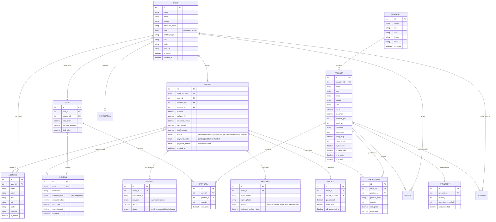
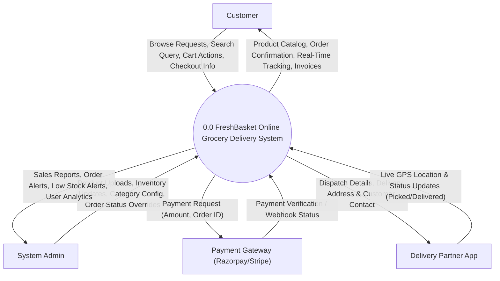
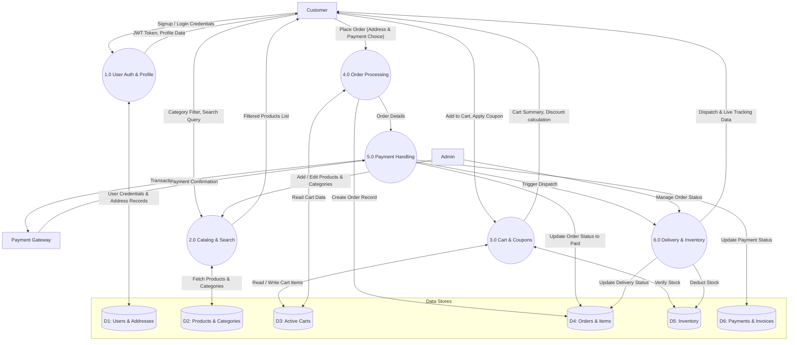
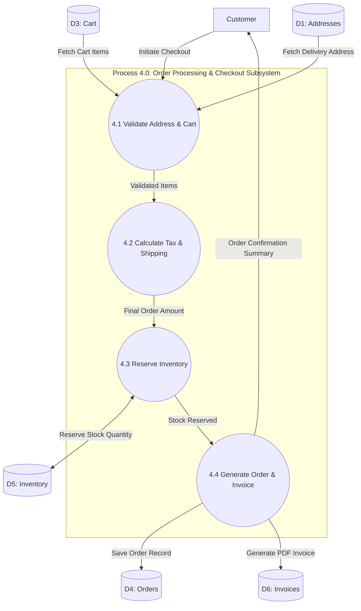

# FreshBasket - System Diagrams (DFD & ER Diagram)

This document presents the complete **Data Flow Diagrams (DFD)** and **Entity-Relationship (ER) Diagram** for **FreshBasket - Online Grocery Delivery System**.

## 1. Entity-Relationship (ER) Diagram --------------------------------------------------------------------------------------------------------------------------
The ER diagram illustrates the database design and logical relationships between entities in the MySQL database schema.

---

## 2. Data Flow Diagram (DFD) -----------------------------------------------------------------------------------------------------------------------------------
Data Flow Diagrams visualize how information flows through the system, identifying external entities, main processes, data stores, and data movements.

---

### 2.1 DFD Level 0 (Context Diagram) ----------------------------------------------------------------------------------------------------------------------------
The Level 0 Context Diagram represents the overall FreshBasket system boundary and its interactions with external entities.

---

### 2.2 DFD Level 1 (Major System Processes) ------------------------------------------------------------------------------------------------------------
The Level 1 DFD decomposes the system into major operational modules and identifies data stores (D1–D6).

---

### 2.3 DFD Level 2 (Detailed Checkout & Order Processing Subsystem) -------------------------------
The Level 2 DFD zooms into the core **Checkout & Order Processing** sub-process (Process 4.0).

---

## 3. Summary of Key Entities & Data Flows -----------------------------------

| Component | Type | Primary Role |
| :--- | :--- | :--- |
| **USER** | Entity / Store | Manages customer profiles, delivery addresses, and admin credentials |
| **PRODUCT & CATEGORY** | Entity / Store | Stores catalog items, images, prices, brands, and category taxonomy |
| **CART & CART_ITEM** | Entity / Store | Manages real-time shopping baskets, active items, and applied discounts |
| **ORDER & ORDER_ITEM** | Entity / Store | Captures purchase history, order statuses, item snapshots, and totals |
| **PAYMENT & INVOICE** | Entity / Store | Tracks financial transactions, payment provider webhooks, and GST invoices |
| **INVENTORY** | Entity / Store | Controls real-time stock levels and low-stock alerts for automatic reordering |
